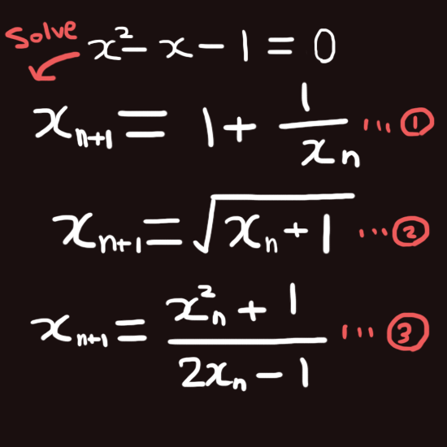

# Recurrence relation

This is written in **C language**

  
To solve this equation, there are three ways.

```
#include <stdio.h>
#include <math.h>

int errorCalculation(float x, float xx);

int main(void)
{
    int NN = 100; //repeat nn times
    int n;
    float xx;

    // Recurrence formula 1
    float x = 1.0;
    printf("Recurrence formula 1: \n");

    for (n = 1; n <= NN; n++)
    {
        //input result of (n+1) into xx
        xx = 1.0 + 1.0 / x;

        // n: 3 digits integer
        // x: 8 digits real number (6 digits decimal part)
        printf("n: %3d, x: %8.6f\n", n, xx);

        // calculate error
        if (errorCalculation(x, xx))
            break;
        x = xx;
    }

    //Recurrence formula 2
    x = 1.0;
    printf("Recurrence formula 2: \n");

    for (n = 1; n <= NN; n++)
    {
        xx = sqrt(x + 1.0);
        printf("n: %3d, x: %8.6f\n", n, xx);

        if (errorCalculation(x, xx))
            break;
        x = xx;
    }

    //Recurrence formula 3
    x = 1.0;
    printf("Recurrence formula 3: \n");

    for (n = 1; n <= NN; n++)
    {
        xx = (x * x + 1) / (2 * x - 1);
        printf("n: %3d, x: %8.6f\n", n, xx);

        if (errorCalculation(x, xx))
            break;
        x = xx;
    }
}


int errorCalculation(float x, float xx)
{
    float EPS = 1.0e-6;
    float gosa;
    
    // fabsf returns absolute value
    gosa = fabsf(xx - x) / fabsf(x);
    if (gosa < EPS)
    {
        printf("Converged! \n \n");
        return 1;
    }
    else
        return 0;
}
```

Result
```
Recurrence formula 1:
n:   1, x: 2.000000
n:   2, x: 1.500000
n:   3, x: 1.666667
n:   4, x: 1.600000
n:   5, x: 1.625000
n:   6, x: 1.615385
n:   7, x: 1.619048
n:   8, x: 1.617647
n:   9, x: 1.618182
n:  10, x: 1.617977
n:  11, x: 1.618056
n:  12, x: 1.618026
n:  13, x: 1.618037
n:  14, x: 1.618033
n:  15, x: 1.618034
n:  16, x: 1.618034
Converged!

Recurrence formula 2:
n:   1, x: 1.414214
n:   2, x: 1.553774
n:   3, x: 1.598053
n:   4, x: 1.611848
n:   5, x: 1.616121
n:   6, x: 1.617443
n:   7, x: 1.617851
n:   8, x: 1.617977
n:   9, x: 1.618016
n:  10, x: 1.618029
n:  11, x: 1.618032
n:  12, x: 1.618034
Converged!

Recurrence formula 3:
n:   1, x: 2.000000
n:   2, x: 1.666667
n:   3, x: 1.619048
n:   4, x: 1.618034
n:   5, x: 1.618034
Converged!
```

Recurrence formula 3 is the most effective way to solve the euqation.
