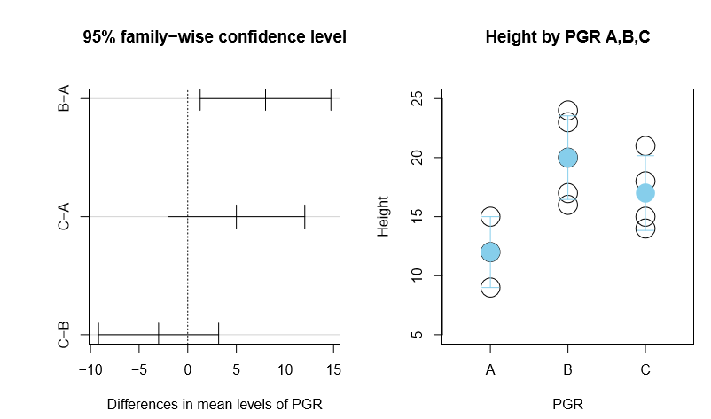

# anova test example

```
# Short break 4-3
d <- read.csv("data/data_BioEnvStat_4c.csv")

attach(d)
boxplot(Height~PGR, main = "Boxplot of Height by PGR condition A,B,C", xlab = "Factor levels : PGR condition", ylab="Height")
detach(d)
```

note : I forgot shapiro test

```
# bartlett test
bartlett.test(Height~PGR, data=d)
```
Bartlett test of homogeneity of variances

data: Height by PGR
Bartlett's K-squared = 0.072775, df = 2, **p-value =0.9643**

⇒ Null hypothesis is selected.
⇒ homogeneity of variance is met

```
# one-way ANOVA
aov(Height~PGR, data=d)
summary(aov(Height~PGR, data=d)

```
Df Sum Sq Mean Sq F value Pr(>F)
PGR 2 120 60.00 5.51 **0.0274 ***
Residuals 9 98 10.89

Signif. codes:
0 ‘***’ 0.001 ‘**’ 0.01 ‘*’ 0.05 ‘.’ 0.1 ‘ ’ 1

⇒ F-value = 5.51, P-value = 0.0274
⇒ Null hypothesis is rejected.

```
group_aov <- aov(Height~PGR, data = d)
TukeyHSD(group_aov)
```

Tukey multiple comparisons of means
95% family-wise confidence level

Fit: aov(formula = Height ~ PGR, data = d)

$PGR
         diff  lwr             upr                p adj
B-A   8     1.271668    14.728332    0.0220092
C-A   5    -2.036658    12.036658    0.1718184
C-B  -3    -9.180368      3.180368    0.4024302

→ C-A, C-B : Null Hypothesis is selected 
→ B-A : Null Hypothesis is rejected

```
# make a figure
plot(TukeyHSD(group_aov, conf.level=0.95))

# make a figure
par(mfrow=c(1,2), mar=c(4,5,5,1), oma=c(0.5, 0.5, 0.5, 0.5))
plot(TukeyHSD(group_aov, conf.level=0.95))

plot(numeric(0),numeric(0), xlim=c(0.5,3.5),ylim=c(5,25),xlab="PGR",ylab="Height",xaxt="n")
title(main="Height by PGR A,B,C
      ")
axis(1, 1:3, c("A","B","C"))
points(rep(1,length(ha)),ha,pch=1,cex=3.0)
points(rep(2,length(hb)),hb,pch=1,cex=3.0)
points(rep(3,length(hc)),hc,pch=1,cex=3.0)

points(1, mean(ha), col="skyblue", pch=16, cex=3.0)
arrows(1, mean(ha)-sd(ha),1,mean(ha)+sd(ha), angle=90, length=0.1, col="skyblue", code=3)

points(2, mean(hb), col="skyblue", pch=16, cex=3.0)
arrows(2, mean(hb)-sd(hb),2,mean(hb)+sd(hb), angle=90, length=0.1, col="skyblue", code=3)

points(3, mean(hc), col="skyblue", pch=16, cex=3.0)
arrows(3, mean(hc)-sd(hc),3,mean(hc)+sd(hc), angle=90, length=0.1, col="skyblue", code=3)
```


