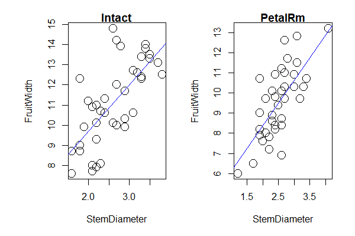

# Linear regression example

## data handling

```
d <- read.csv("data/data_BioEnvStat_5g.csv")

stem1 <- subset(d, select=StemDiameter, Trt=="Intact")
stem1
fruit1 <-subset(d,select=FruitWidth, Trt == "Intact")
fruit1

stem2 <- subset(d, select=StemDiameter, Trt=="PetalRm")
stem2
fruit2 <-subset(d,select=FruitWidth, Trt=="PetalRm")
fruit2
```

## linear regression analysis

```
#intact-------------------------------------------

x1<-as.data.frame(stem1)
x1
y1<-as.data.frame(fruit1)
y1
x1y1<-cbind(x1,y1)
x1y1

#------------------------------------------------

lm<- lm(FruitWidth~StemDiameter, data=x1y1)
lm

#FruitWidth =  StemDiameter* 0.2138 + 0.2454

summary(lm)

# Multiple R-squared: 0.496
# p-value: 5.636e-07

# The linear regression is trustworthy

#PetalRm------------------------------------------

x2<-as.data.frame(fruit2)
x2
y2<-as.data.frame(stem2)
y2
x2y2<-cbind(x2,y2)
x2y2

#------------------------------------------------

lm2<- lm(StemDiameter~FruitWidth, data=x2y2)
lm2

#StemDiameter = FruitWidth*0.2313 + 0.3213  

summary(lm2)

# Multiple R-squared: 0.5204
# p-value: 3.22e-07

# The linear regression is trustworthy
```

## make a plot

```
# make a plot -----------------------------------
par(mfrow=c(1,2),mar=c(4,5,1,1),oma=c(1,1,1,1))

plot(x1y1,cex=2)
title(main="Intact")
abline(lm,lty=1,lwd=1,col="blue")


plot(x2y2,cex=2)
title(main="PetalRm")
abline(lm2,lty=1,lwd=1,col="blue")
```



## Checking assumptions

 
 ```
 # normality of error terms-----------------------------------

shapiro.test(lm$res) # p-value = 0.1317
shapiro.test(lm2$res) # p-value = 0.5205
# the errors follow a normal distribution


# Independence of error terms ------------------------------
# install.packages("lmtest")
library("lmtest")
dwtest(lm) # DW = 1.4839, p-value = 0.05008
dwtest(lm2) # DW = 1.3598, p-value = 0.0195


# constant variance of error terms -------------------------

plot(scale(lm$fitted),scale(lm$res))
abline(h=0)


plot(scale(lm2$fitted),scale(lm2$res))
abline(h=0)

library(car)
ncvTest(lm) # p = 0.28637
ncvTest(lm2) # p = 0.89268

# the errors have constant variance
 ```
