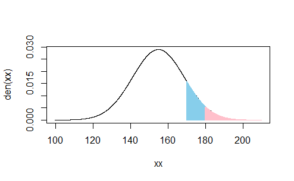
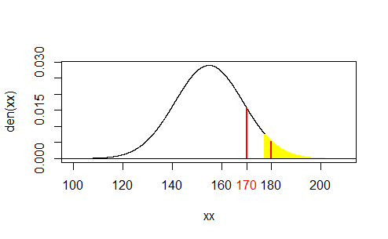

# normal distribution in R

How to draw a normal distribution graph

```
# 1.Input a data into x 
x <- data$Height
sigma<-sd(x)
mu<-mean(x)

# 2-1. normal distribution function
y <- (1/sqrt(2*pi*sigma^2))*exp(-(x-mu)^2/2*sigma^2)

# 2-2. or define function
# In this case, y = den(x)
den <- function(x) {
  (1/sqrt(2*pi*sigma^2))*exp(-(x-mu)^2/(2*sigma^2))
}

# 2-3. or use already defined function in R
y <- dnorm(x, mean=mu, sd=sigma)

# 3. Draw a plot by using x and y
# type = "l" : line
# col : color
# xlim, ylim : numeric vectors of length 2, 
# xlab, ylab : a title for the x, y axis
# giving the x and y coordinates ranges.
plot(x, y, type="l", col="red", xlim="", ylim="", xlab="", ylab="" )

# 4. paint the range under the line of a graph 
# points is a generic function to draw a sequence of points at the specified coordinates
# type="h" for histogram-like vertical lines

# taller than height1
ut <- seq(height1, mu+4*sigma, 0.01)
points(ut, den(ut), lty="solid", lwd=2, type="h", col="skyblue")
# taller than height2
ut <- seq(height2, mu+4*sigma, 0.01)
points(ut, den(ut), lty="solid", lwd=2, type="h", col="pink")

# 5. integrate the area
# size of the area = probability ex) if the integrated area is 0.1345975, P = 0.1345
# integrate: integrate den from lower to upper
integrate(den, lower=height1, upper=mu+4*sigma)

```


## normal distribution example
This was my biological statistics assignment.

```
library("readxl")

# Read data
data<-read_excel("C:/Users/jsid1/Documents/3_Study/0_OnlineStudy/4_BiologicalStatistics/BioEnvStat_2/data/data_ShortBreak2_3.xlsx", 1)
x<-data$Height
mu<-mean(x)
sigma<-sd(x)
height1<-170
height2<-180

#zscore
zscore1<-(height1-mu)/sigma
zscore2<-(height2-mu)/sigma
zscore1 #1.104772 
zscore2 #1.832526 

# p1<-0.8643
# p2<-0.9664

# draw a graph
xx <- seq(mu-4*sigma, mu+4*sigma, 0.01)
den <- function(x) {
  (1/sqrt(2*pi*sigma^2))*exp(-(x-mu)^2/(2*sigma^2))
}
plot(xx, den(xx), type="l", col="black")

# height1 (170cm)
# upper tail
ut <- seq(height1, mu+4*sigma, 0.01)
points(ut, den(ut), lty="solid", lwd=2, type="h", col="skyblue", xlab="height(cm)", ylab="")
integrate(den, lower=height1, upper=mu+4*sigma)

# height2 (180cm)
# upper tail
ut <- seq(height2, mu+4*sigma, 0.01)
points(ut, den(ut), lty="solid", lwd=2, type="h", col="pink")
integrate(den, lower=height2, upper=mu+4*sigma)
```



Check whether height1 or height2 is included in 95% of this group or not.

```
# draw a graph
xx <- seq(mu-4*sigma, mu+4*sigma, 0.01)
den <- function(x) {
  (1/sqrt(2*pi*sigma^2))*exp(-(x-mu)^2/(2*sigma^2))
}
plot(xx, den(xx), type="l", col="black")

# Find height of 95%
p<- 1.64*sigma+mu
p # 177.3545
ut <- seq(p, mu+4*sigma, 0.01)
points(ut, den(ut), lty="solid", lwd=2, type="h", col="yellow", xlab="height(cm)", ylab="")

# height1 (170cm)
# height2 (180cm)

xpos <- c(height1, height2)
# segments : draw line segments between pairs of points
# segements(x0, y0, x1=x0, y1=y0, ...)
segments(
  xpos, rep(0, 2), 
  xpos, den(xpos), 
  col="red", lwd=2
)
axis(1, xpos, col.axis="red", las=1)

abline(0,0)
```


