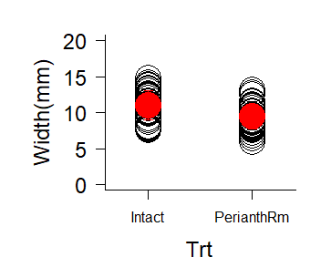
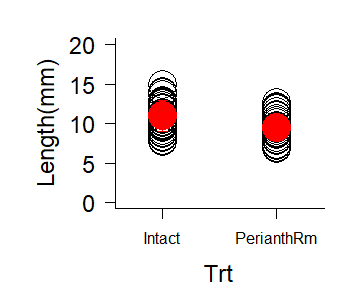
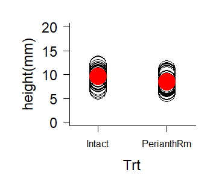

# Two sample T test

```
# Short breka 3-1
data<-read.csv("data/data_ShortBreak3_1.csv", header=T)

width1 <- subset(data, Trt=="Intact", select = Width)
width1<- width1[!is.na(width1)]
width1
length1 <- subset(data, Trt=="Intact", select = Length)
length1<- length1[!is.na(length1)]
length1
height1 <- subset(data, Trt=="Intact", select = Height)
height1<- height1[!is.na(height1)]
height1


width2 <- subset(data, Trt=="PerianthRm", select = Width)
width2<- width2[!is.na(width2)]
width2
length2 <- subset(data, Trt=="PerianthRm", select = Length)
length2<- length2[!is.na(length2)]
length2
height2 <- subset(data, Trt=="PerianthRm", select = Height)
height2<- height2[!is.na(height2)]
height2

```

```

# making figure

# mar : A numerical vector of the form c(bottom, left, top, right)
# which gives the number of lines of margin to be specified on the
# four sides of the plot. The default is c(5,4,4,2)+0.1

# oma : A vector of the form c(bottom, left, top, right)
# giving the size of the outer margins in lines of text

# cex.axis, cex.lab : font-size of y, x axis

# width
par(mfrow=c(1, 1), mar=c(4, 5, 1, 1), oma=c(1, 1, 1, 1))
space <- 0.35
plot(
  numeric(0), numeric(0), 
  xlim=c(1-space, 2+space), ylim=c(0, 20), 
  xlab="Trt", ylab="Width(mm)", cex.axis=1.5, cex.lab=1.5,  
  xaxt="n", bty="l", las=1
)
axis(1, 1:2, c("Intact", "PerianthRm"), las=1)
points(rep(1, length(width1)), width1, pch=1, cex=4.0)
points(rep(2, length(width2)), width2, pch=1, cex=4.0)

# mean
# Intact
points(1, mean(width1), col="light blue", pch=16, cex=4.0)
arrows(
  1, mean(width1)-sd(width1), 1, mean(width1)+sd(width1), 
  angle=90, length=0.05, col="light blue", lty="solid", code=3
)
#PerianthRm
points(2, mean(width2), col="light blue", pch=16, cex=4.0)
arrows(
  rep(2, 2), c(mean(width2)-sd(width2), mean(width2)+sd(width2)), 
  rep(2, 2), c(mean(width2)+sd(width2), mean(width2)-sd(width2)), 
  angle=90, length=0.05, col="light blue", lty="solid"
)

```

```
#length

par(mfrow=c(1, 1), mar=c(4, 5, 1, 1), oma=c(1, 1, 1, 1))
space <- 0.35
plot(
  numeric(0), numeric(0), 
  xlim=c(1-space, 2+space), ylim=c(0, 20), 
  xlab="Trt", ylab="Length(mm)", cex.axis=1.5, cex.lab=1.5,  
  xaxt="n", bty="l", las=1
)
axis(1, 1:2, c("Intact", "PerianthRm"), las=1)
points(rep(1, length(length1)), length1, pch=1, cex=4.0)
points(rep(2, length(length2)), length2, pch=1, cex=4.0)

# mean
# Intact
points(1, mean(length1), col="red", pch=16, cex=4.0)
arrows(
  1, mean(length1)-sd(length1), 1, mean(length1)+sd(length1),
  angle=90, length=0.05, col="red", lty="solid", code=3
)
#PerianthRm
points(2, mean(length2), col="red", pch=16, cex=4.0)
arrows(
  rep(2, 2), c(mean(length2)-sd(length2), mean(length2)+sd(length2)), 
  rep(2, 2), c(mean(length2)+sd(length2), mean(length2)-sd(length2)), 
  angle=90, length=0.05, col="red", lty="solid"
)

```

```

#height

par(mfrow=c(1, 1), mar=c(4, 5, 1, 1), oma=c(1, 1, 1, 1))
space <- 0.35
plot(
  numeric(0), numeric(0), 
  xlim=c(1-space, 2+space), ylim=c(0, 20), 
  xlab="Trt", ylab="height(mm)", cex.axis=1.5, cex.lab=1.5,  
  xaxt="n", bty="l", las=1
)
axis(1, 1:2, c("Intact", "PerianthRm"), las=1)
points(rep(1, length(height1)), height1, pch=1, cex=4.0)
points(rep(2, length(height2)), height2, pch=1, cex=4.0)

# mean
# Intact
points(1, mean(height1), col="red", pch=16, cex=4.0)
arrows(
  1, mean(height1)-sd(height1), 1, mean(height1)+sd(height1),
  angle=90, length=0.05, col="red", lty="solid", code=3
)
#PerianthRm
points(2, mean(height2), col="red", pch=16, cex=4.0)
arrows(
  rep(2, 2), c(mean(height2)-sd(height2), mean(height2)+sd(height2)), 
  rep(2, 2), c(mean(height2)+sd(height2), mean(height2)-sd(height2)), 
  angle=90, length=0.05, col="red", lty="solid"
)

```

